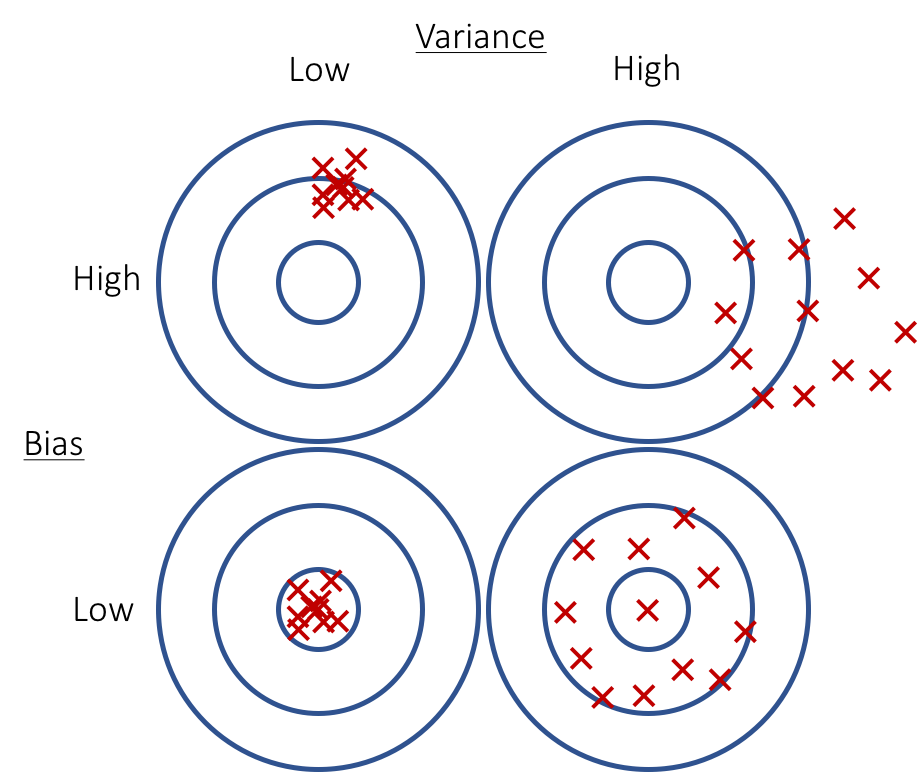
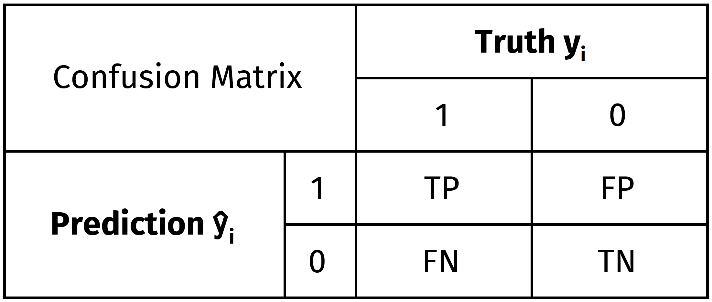
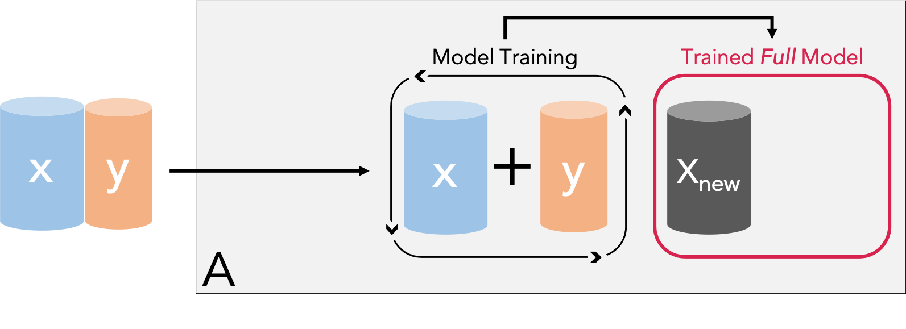
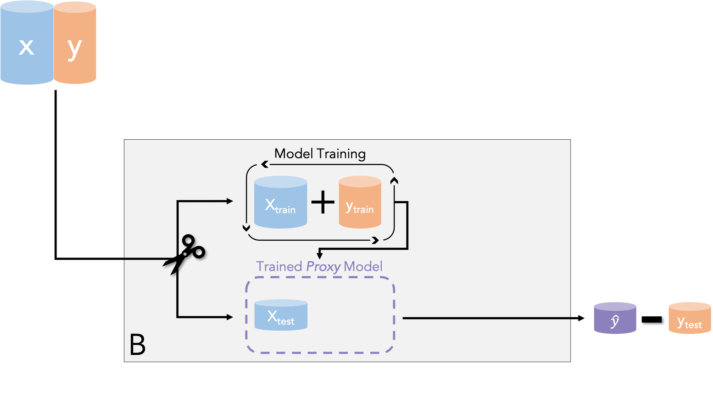
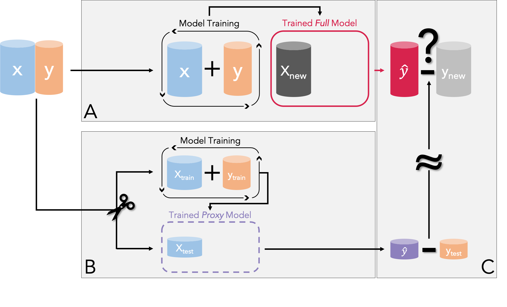
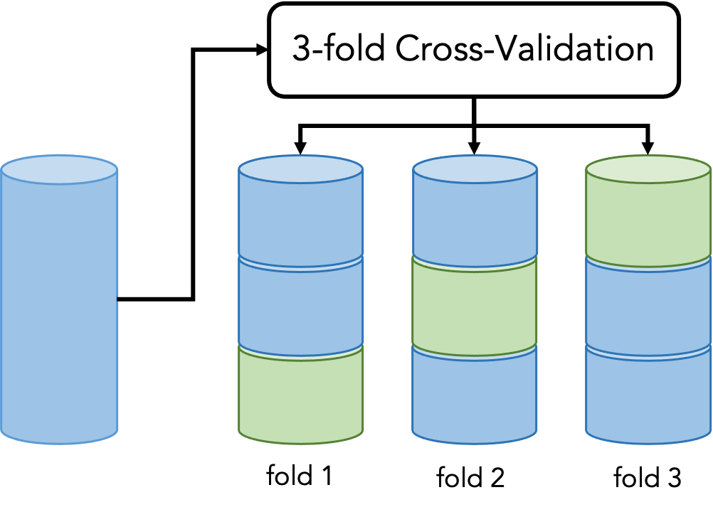
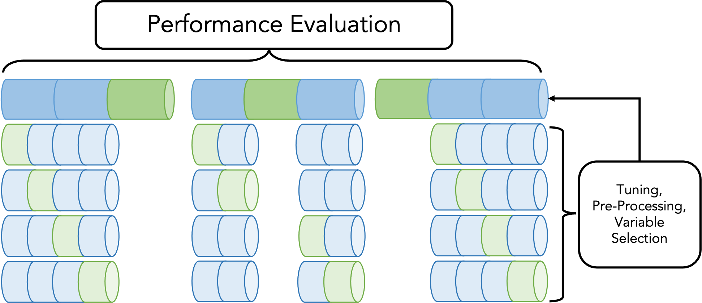

```{r setup, include=FALSE, cache=FALSE}
library(knitr)
opts_chunk$set(echo = TRUE, fig.align = "center", tidy = FALSE, comment = NA,
  message = FALSE, warning = FALSE, cache = FALSE, autodep = FALSE, eval = TRUE)
options(scipen = 1, digits = 2, ggplot2.discrete.colour = list(RColorBrewer::brewer.pal(2, "Dark2"), RColorBrewer::brewer.pal(10, "RdYlBu"), rep(RColorBrewer::brewer.pal(10, "RdYlBu"), 6)))
```


## Welcome!

You can find all materials for this workshop here: <https://github.com/DreamTeamSG/ml_workshop/>

{width="30%"}\centering
\

This workshop is based on the following tutorial paper:\
Pargent F., Schoedel R., Stachl C. (2023). Best Practices in Supervised Machine Learning: A Tutorial for Psychologists. *Advances in Methods and Practices in Psychological Science, 6(3)*. [doi:10.1177/25152459231162559](https://journals.sagepub.com/doi/full/10.1177/25152459231162559)

These workshop materials are a "living" joint project with  \
**Ramona Schoedel**, **Florian Pargent**, & **Clemens Stachl**.

## Agenda 

**Programm for today**

| Time              | Session                          | Duration |
|-------------------|----------------------------------|----------|
| 9:00 AM – 9:25 AM | Welcome & Get-to-know            | 25 min   |
| 9:25 AM – 9:50 AM | Introduction to Machine Learning | 25 min   |
| 9:50 AM – 10:35 AM| Performance Evaluation           | 45 min   |
| 10:35 AM – 10:50 AM| Coffee Break                    | 15 min   |
| 10:50 AM – 12:00 PM| Coding Session I                | 70 min   |
| 12:00 PM – 1:00 PM| Lunch Break                      | 60 min   |
| 1:00 PM – 1:45 PM | Model Overview                   | 45 min   |
| 1:45 PM – 2:30 PM | Coding Session II                | 75 min   |
| 2:30 PM – 2:45 PM | Coffee Break                     | 15 min   |
| 2:45 PM – 3:45 PM | Model Interpretation             | 60 min   |
| 3:45 PM – 4:00 PM | Coffee Break                     | 15 min   |
| 4:00 PM – 4:45 PM | Coding Session III               | 45 min   |
| 4:45 PM – 5:00 PM | Summary & Closing Remarks        | 15 min   |


# Introduction to Machine Learning

## Applications in Personality Psychology

Machine learning methods are increasingly being used for personality psychological research questions.

Examples for predictive modeling: 

-   Facebook activity data -\> personality traits\   
    [e.g., @kosinski2013; @youyou_2015]
-   Facebook language -\> affective states\   
    [@eichstaedt2020]
-   Demographics & performance -\> student retention\   
    [@matz2023] 
-   Online banking records -\> personality traits\   
    [@gladstone2019]
-   Psychological panel data -\> sick days, life satisfaction, ...  \   
    [@pargent_predictive_2018]
-   ...


## Applications in Personality Psychology

... with mobile sensing data: 

-   situational characteristics [@Schoedel2023]
-   personality states [@ruegger2020]
-   personality traits [@Stachl2020]
-   life outcomes [@digutsch_everyday_smartphone_2025]
-   satisfaction with life [@bergmann_satisfaction_life_2025]
-   authoritarianism [@koch_digital_authoritarian_2025]

## Predictive Modeling Mindset

We can distinguish between two modeling cultures [@breiman_statistical_2001]: 

-   Classical

    -   data can be described with a stochastic model
    -   "we assume a linear relationship..."
    -   model-evaluation: goodness-of-fit indices ($R^2$, AIC, etc.),
        effect direction, residuals
    -   sometimes good for explanation
    -   often bad for prediction

-   Algorithmic

    -   data is created by an unknown, potentially complex process
    -   find a function that can predict the target with high accuracy
    -   model-evaluation = prediction accuracy
    -   often good for prediction
    -   often (still) bad for explanation
    
  
## Predictive Modeling Mindset

**Explanation vs. Prediction**

-   Social science`s heavy focus on explanation [@yarkoni_choosing_2017]
-   Models often not adequately validated\
-   "... irrelevant theory and questionable conclusions ..." [@breiman_statistical_2001]
-   High-dimensional data - complex relationships, hard to hypothesize
-   Create new measures, reflect on and improve existing theories
-   See if theories predict relevant criteria [@shmueli_to_2010]


## Predictive Modeling Mindset

**Summary**

-   **Goal:** Make data-driven predictions/decisions

-   **Focus:** Predicting new, unseen observations

-   Examples:

    -   predict rent for new flats
    -   recognize individual differences in user data
    -   identify faces/objects in images
    -   recognize words/language in audio data


## Basic Terminology

**The 1x1 of Supervised Machine Learning Vocabulary**

-   **Target**: variable of interest (e.g., personality traits score)
-   **Features**: predictor variables (e.g., smartphone usage behaviors)


## Basic Terminology

**The 1x1 of Supervised Machine Learning Vocabulary**

-   **Task**:

    -   Regression: for continuous targets
    -   Classification: for categorical/binary targets

```{r, echo=FALSE, out.width="\\linewidth", fig.height=4, fig.width=9,message =FALSE, results='hide'}
library(rpart.plot)
library(patchwork)
library(AmesHousing)
library(ggplot2)
library(mlr3verse)
library(mlr3viz)

data(ptitanic)
ptitanic <- na.omit(ptitanic)

ames <- make_ames()
ames <- ames[ames$Sale_Price < 700000 & ames$Gr_Liv_Area < 4000, 
  c("Gr_Liv_Area", "Year_Built", "Sale_Price")]

## reduce data set for better visibility
set.seed(589)
select <- sample(1:nrow(ames), 0.10*nrow(ames)) #take only 10% of the sample for this didactic example
ames <- ames[select,]

ames$Year_Built <- as.numeric(ames$Year_Built)
ames$Gr_Liv_Area <- as.numeric(ames$Gr_Liv_Area)
ames$Sale_Price <- ames$Sale_Price / 1000 # new unit: 1000 dollars
task_ames <- as_task_regr(ames, id = "Ames Housing", target = "Sale_Price")

ptitanic$parch <- as.numeric(ptitanic$parch)
task_titanic <- TaskClassif$new(id = "Titanic", backend = ptitanic, 
  target = "survived", positive = "survived")$select(c("age", "parch"))

lm <- lrn("regr.lm")
logr <- lrn("classif.log_reg", predict_type = "prob")

(plot_learner_prediction(learner = lm, task = task_ames) + ggtitle("AmesHousing") + scale_fill_viridis_c(option = "turbo")) + 
  (plot_learner_prediction(learner = logr, task = task_titanic) + ggtitle("Titanic"))
```


## Basic Terminology

**The 1x1 of Supervised Machine Learning Vocabulary**

-   **Predictive Model**: 

    -   Any (statistical) model that generates (accurate) predictions of some target variable, based on (a series of) features [@kuhn_applied_2013; @Pargent2023]
    -   Synonym: Machine Learning Model
    -   Examples: 
    -   ordinary linear regression
    -   penalized linear models: lasso, ridge, elastic net
    -   tree models: decision tree, random forest, gradient boosting
    -   support vector machines
    -   deep neural networks
    -   ...


## Basic Terminology

**The 1x1 of Supervised Machine Learning Vocabulary**

-   **Predictive Model**

-   **Model Parameters**: 

    -   Different types of models differ in their type of parameters (e.g., $\beta$ coefficients in linear regression)
    -   They have to be estimated before a model can make predictions

-   **Algorithms**:

    -   Formal set of rules used to estimate appropriate values for the model parameters from data (e.g., least squares algorithm)


## Data & methods used today

**Data Set Used**

In this workshop, we use a publicly available mobile sensing data set: 

-   Predicting personality from patterns of behavior collected with smartphones [@Stachl2020, PNAS]

-   Self-report questionnaire data:

    -   German Big Five Structure Inventory (BFSI)\
        [@arendasy_manual_2011]

    -   Demographics (age, gender, education)

-   Mobile sensing data: recorded for 30 days on the smartphone

    -   communication & social behavior, app-use, music consumption,
        overall phone use, day-nighttime activity


## Data & methods used today

**Software Used**

Machine learning meta packages in R:

-   **mlr3** package [@mlr3]:

    -   standardized interface for machine learning
    -   detailed tutorial at <https://mlr3book.mlr-org.com/>
    -   mlr-org packages: mlr3pipelines, mlr3oml, ...
    -   mlr3 is written in R6 (more about that later!)

{height="10%"}\centering

-   Alternative: **tidymodels** packages [@kuhn_tidymodels_2018]


    
    
# Performance Evaluation

## Performance Evaluation

The quality of a trained predictive model is evaluated based on its
magnitude of **error on new (unseen) data**, drawn from the same
population:

\ 

> "How well does a predictive model I have already estimated work
> when I use it to predict observations from my practical application,
> in which I do not know the target values?"

\

**First things first: How to quantify the quality of models?**


## The Bias-Variance Trade-Off

Helpful mental model to reflect on which factors influence the performance of a predictive model in theory:

**Prediction Error = f(Bias, Variance, Noise)**


## The Bias-Variance Trade-Off

{width="60%"}\centering

-   **Bias:** deviation of the average prediction from the true value
-   **Variance:** variability of predictions based on different samples
-   **Noise:** irreducible error of the true population model
-   **Goal: Find a predictive model with low bias AND low variance**


## The Bias-Variance Trade-Off

```{r, echo=FALSE}
library(ggplot2)
library(gridExtra)

# population model
f <- function(x)10*sin(0.8*x)+x

sim <- function(n, f, xmin = -5, xmax = 5, sigma = 5){
  x = runif(n, xmin, xmax)
  y = f(x) + rnorm(n, sd = sigma)
  data.frame(x, y)
}

bias_plot <- function(data, y_mean, y_10, y_90){
  ggplot(data = data, aes(x = x, y = y, colour = sample)) +
    geom_point(size = 0.8) + 
    geom_vline(xintercept = 2.5, linetype = "dashed", 
      linewidth = 0.6, col = "darkgrey") + #black line for x = 2.5
    geom_line(stat="smooth", method = "lm", size = 0.8, alpha = 0.3) + 
    stat_function(fun = f, color = "black", size = 0.6) + 
    geom_point(aes(x = 2.5, y = y_10), col = "black", shape = 95, size = 6) +
    geom_point(aes(x = 2.5, y = y_90), col = "black", shape = 95, size = 6) + 
    geom_point(aes(x = 2.5, y = y_mean), col = "black", shape = 4, size = 3) +
    xlim(-5, 5) + ylim(-33, 32) + theme_bw() +
    theme(legend.position="none")
}

var_plot <- function(data, y_mean, y_10, y_90){
  ggplot(data = data, aes(x = x, y = y, group = sample, colour = sample)) +
    geom_point(size = 0.7) + 
    geom_vline(xintercept = 2.5, linetype = "dashed", 
      linewidth = 0.6, col = "darkgrey") +  #black line for x = 2.5
    geom_line(stat = "smooth", method = "lm", formula = y ~ poly(x, d, raw = TRUE), size = 0.8, alpha = 0.3) + 
    stat_function(fun = f, color = "black", size = 0.4) + 
    geom_point(aes(x = 2.5, y = y_10), col = "black", shape = 95, size = 6) +
    geom_point(aes(x = 2.5, y = y_90), col = "black", shape = 95, size = 6) +
    geom_point(aes(x = 2.5, y = y_mean), col = "black", shape = 4, size = 3) +
    xlim(-5, 5) + ylim(-33, 32) + theme_bw() +
    theme(legend.position="none") 
}


## Example 1
# simulate data
n <- 12 # number of points per sample
m <- 60 # number of samples
d <- 7 # degree of polynomial

set.seed(5)
dat <- Reduce(f = rbind, x = lapply(1:m, FUN = function(x){sim(n, f)}))
dat$sample <- factor(rep(1:m, each = n))

## get predictions for x = 2.5 for better visualization 
df_results_bias_1 <- data.frame(sample = unique(dat$sample), y_hat = NA)

for(i in unique(dat$sample)){
  fit_bias1 = lm(y~x, dat[dat$sample == i, ])
  df_results_bias_1$y_hat[df_results_bias_1$sample == i] = predict.lm(fit_bias1, data.frame(x = 2.5)) 
}

perc_b1 <- quantile(df_results_bias_1$y_hat, c(0.10, 0.90))

bias_1 <- bias_plot(dat, y_mean = mean(df_results_bias_1$y_hat), y_10 = perc_b1[1], y_90 = perc_b1[2]) + 
  ggtitle(label = "Inflexible Model", subtitle = "A1") + 
  theme(plot.title = element_text(size = 15, hjust = 0.5),  plot.subtitle = element_text(size = 15)) +
  annotate("label", x = 0, y = -32, size = 3, label = "Bias: High | Variance: Low") 
  
  
## get predictions for x = 2.5 for better visualization 
df_results_var1 <- data.frame(sample = unique(dat$sample), y_hat = NA)
  
for(i in unique(dat$sample)){
  fit_var1 = lm(y ~ poly(x, d, raw = TRUE), dat[dat$sample == i, ])
  df_results_var1$y_hat[df_results_var1$sample == i] = predict.lm(fit_var1, data.frame(x = 2.5)) 
} 
  
perc_v1 <- quantile(df_results_var1$y_hat, c(0.10, 0.90))

var_1 <- var_plot(dat, y_mean = mean(df_results_var1$y_hat), y_10 = perc_v1[1], y_90 = perc_v1[2]) + 
  ggtitle(label = "Flexible Model", subtitle = "B1") + 
  theme(plot.title = element_text(size = 15, hjust = 0.5), plot.subtitle = element_text(size = 15)) +
  annotate("label", x = 0, y = -32, size = 3, label = "Bias: Low | Variance: High")


## Example 2
# simulate data
n <- 50 # number of points per sample
m <- 60 # number of samples
d <- 7 # degree of polynomial

set.seed(5)
dat <- Reduce(f = rbind, x = lapply(1:m, FUN = function(x){sim(n, f)}))
dat$sample <- factor(rep(1:m, each = n))

## get predictions for x = 2.5 for better visualization 
df_results_bias_2 <- data.frame(sample = unique(dat$sample), y_hat = NA)

for(i in unique(dat$sample)){
  fit_bias2 <- lm(y~x, dat[dat$sample == i, ])
  df_results_bias_2$y_hat[df_results_bias_2$sample == i] <- predict.lm(fit_bias2, data.frame(x = 2.5)) 
} 

perc_b2 <- quantile(df_results_bias_2$y_hat, c(0.10, 0.90))

bias_2 <- bias_plot(dat, y_mean = mean(df_results_bias_2$y_hat), y_10 = perc_b2[1], y_90 = perc_b2[2]) + 
  ggtitle(label = "Inflexible Model", subtitle = "A2") + 
  theme(plot.title = element_text(size = 15, hjust = 0.5),  plot.subtitle = element_text(size = 15)) +
  annotate("label", x = 0, y = -32, size = 3, label = "Bias: High | Variance: Low") 


## get predictions for x = 2.5 for better visualization 
df_results_var2 <- data.frame(sample = unique(dat$sample), y_hat = NA)

for(i in unique(dat$sample)){
  fit_var2 <- lm(y ~ poly(x, d, raw = TRUE), dat[dat$sample == i, ])
  df_results_var2$y_hat[df_results_var1$sample == i] <- predict.lm(fit_var2, data.frame(x = 2.5)) 
} 

perc_v2 <- quantile(df_results_var2$y_hat, c(0.10, 0.90))

var_2 <- var_plot(dat, y_mean = mean(df_results_var2$y_hat), y_10 = perc_v2[1], y_90 = perc_v2[2]) + 
  ggtitle(label = "Flexible Model", subtitle = "B2") + 
  theme(plot.title = element_text(size = 15, hjust = 0.5), plot.subtitle = element_text(size = 15)) +
  annotate("label", x = 0, y = -32, size = 3, label = "Bias: Low | Variance: Low")

```

Example 1: 60 Samples with **N = 12** each

```{r, echo=FALSE, out.width="\\linewidth", fig.width=10, fig.height=5}
grid.arrange(bias_1, var_1, ncol = 2, nrow = 1, widths = c(2, 2))
```


## The Bias-Variance Trade-Off

Example 2: 60 Samples with **N = 50** each

```{r, echo=FALSE, out.width="\\linewidth", fig.width=10, fig.height=5}
grid.arrange(bias_2, var_2, ncol = 2, nrow = 1, widths = c(2, 2))
```


## Performance Measures

**Regression Tasks**

Idea behind: Quantify a "typical" deviation from the true value

The statistician's favorite:

$$MSE = \frac{1}{n} \sum_{i=1}^n (y_i-\hat{y_i})^2$$

The social scientist's favorite:

$$R^2 = 1- \frac{residual\ sum\ of\ squares}{total\ sum\ of\ squares} = 
1-\frac{\sum_{i=1}^n (y_i-\hat{y_i})^2}{\sum_{i=1}^n (y_i-\bar{y})^2}$$


## Performance Measures

**Classification Tasks**

Idea behind: Quantify the proportion of misclassified cases in all cases

Mean misclassification error ($\widehat{=}$ MSE)

$$MMCE = \frac{1}{n} \sum_{i=1}^n I(y_i \neq \hat{y_i})$$


## Performance Measures

**Classification Tasks**

{width="100%"}\centering

-   Sensitivity = TP/(TP+FN)\
-   Specificity = TN/(TN+FP)\
-   Positive predictive value = TP/(TP+FP)
-   Negative predictive value = TN/(TN+FN)


## Resampling Strategies for Model Evaluation

**The Idea Behind Resampling**

-   How well does our model predict **new data**?

-   But how to get **new data**?

    -   Option 1: collect new data **;-)**
    -   Option 2: use prediction error in-sample **:-(**
    -   Option 3: use available data in a smart way **:-)**
    
-   Resampling = **Smart Recycling**! 

-   That is, to estimate the performance of our model, split the data set:

    -   **Training set**: train the model
    -   **Test set**: compute performance


## Resampling Strategies for Model Evaluation

**The Idea Behind Resampling**

Learn a functional relationship between **X** and **y**: 
\
\

{width="100%"}\centering

**Central question: How does the model perform during application?** 


## Resampling Strategies for Model Evaluation

**The Idea Behind Resampling**

\centering


## Resampling Strategies for Model Evaluation

**The Idea Behind Resampling**

\centering


## Resampling Strategies for Model Evaluation 

IMPORTANT NOTE: Do not get confused by the different models!

\textcolor{red}{Full Model:}

-   trained on the **whole dataset**
-   will be used in **practical applications**

\textcolor{violet}{Proxy Model:}

-   trained on a **training set**
-   is only a **tool for performance estimation**
-   can be **discarded** after test set predictions


## Resampling Strategies for Model Evaluation

**Why Do We Have to Separate Training and Test Data?**

-   To avoid getting fooled by **Overfitting**:

    -   Model adjusts to a set of given data points too closely
    -   Sample specific patterns are learned ("fitting the noise")
    -   Can be compared to "learning something by heart"

-   Many flexible models predict training data (almost) perfectly:

    -   Training ("in-sample") performance is useless to judge the model's performance on new data ("out-of-sample")!


## Resampling Strategies for Model Evaluation

**The Concept of Overfitting**

```{r, echo=FALSE, out.width="\\linewidth", fig.width=7, fig.height=5}
## prepare visualization 
library(cowplot)
library(magick)
library(ggplot2)


# code was provided by the working group of computational statistics 
# led by Bernd Bischl at LMU Munich

# plot "Example of Overfitting/Model Evaluation I"

.h <- function(x) 0.5 + 0.4 * sin(2 * pi * x)
h <- function(x) .h(x) + rnorm(length(x), mean = 0, sd = 0.05)
n <- 22L
set.seed(123)
x.all <- seq(0, 1, length = n)
ind <- c(1, sample(1:(n-1), size = round((n-3)/2), replace = FALSE), n)

x <- x.all[ind]
y <- h(x)
x.test <- x.all[-ind]
y.test <- h(x.all[-ind])

line.palette <- RColorBrewer::brewer.pal(3, "Dark2")
baseplot <- function() {
  par(mar = c(2, 2, 1, 1) + 2.2)
  plot(.h, lty = 2L, xlim = c(0, 1), ylim = c(-0.1, 1), ylab = "", xlab = "", cex.axis = 0.8)
  points(x, y, pch = 19L)
  points(x.test, y.test)
  legend(x = "bottomleft", legend = c("population", "training set", "test set"),
         col = "black", lty = c(2L, NA, NA), pch = c(NA, 19L, 21L), cex = 0.8)
}

p1 <- lm(y ~ poly(x, 1, raw = TRUE))
p3 <- lm(y ~ poly(x, 3, raw = TRUE))
p8 <- lm(y ~ poly(x, 8, raw = TRUE))
mods <- list(p1, p3, p8)
x.plot <- seq(0, 1, length = 500L)

## create plot and save 
baseplot()
for (i in seq_along(mods)) {
  lines(x.plot, predict(mods[[i]], newdata = data.frame(x = x.plot)),
        col = line.palette[i], lwd = 2L)
}
legend("topright", c("flexibility too low", "flexibility optimal", "flexibility too high"),
       col = line.palette, lwd = 2L, cex = 0.8)

d <- lapply(1:9, function(i) {
  mod <- lm(y ~ poly(x, degree = i, raw = TRUE))
  list(
    train = mean((y - predict(mod, data.frame(x = x)))^2),
    test = mean((y.test - predict(mod, data.frame(x = x.test)))^2)
  )
})
title(xlab = "x", ylab = "y", cex.lab = 0.8)

```


## Resampling Strategies for Model Evaluation 

**The Concept of Overfitting**

```{r, echo=FALSE, out.width="\\linewidth", fig.width=6, fig.height=4}
# code was provided by the working group of computational statistics 
# led by Bernd Bischl at LMU Munich

## create plot 
par(mar = c(4, 4, 2, 2) + 1)
plot(1, type = "n", xlim = c(1, 9), ylim = c(0, 0.06),
     ylab = "MSE", xlab = "degree of flexibility", cex.lab = 0.8, cex.axis = 0.8)
lines(1:9, sapply(d, function(x) x$train), type = "b")
lines(1:9, sapply(d, function(x) x$test), type = "b", col = "gray")

legend("topright", c(expression(MSE[train]), expression(MSE[test])), lty = 1L, 
       col = c("black", "gray"), cex = 0.8)
text(3.75, 0.02, "high bias,\nlow variance", bg = "white", cex = 0.8)
arrows(4.75, 0.02, 2.75, 0.02, code = 2L, lty = 2L, length = 0.1)

text(8, 0.02, "low bias,\nhigh variance", bg = "white", cex = 0.8)
arrows(9, 0.02, 7, 0.02, code = 1, lty = 2, length = 0.1)

```


## Resampling Strategies for Model Evaluation 

**Training Set vs. Test Set -- Dilemma**

-   Training set

    -   as large as possible, else performance is underestimated
    -   large enough to learn well
    -   rule of thumb: 2/3

-   Test set

    -   as large as possible, else high variance in performance
        estimates
    -   large enough for stable performance evaluation
    -   rule of thumb: 1/3
        

-   [Validation set (only if you have many many observations!)]

    -   evaluation of the best final model on unused data


## Resampling Strategies for Model Evaluation @bischl_resampling_2012

-   The resampling strategy that we have learned about so far is called **holdout**

-   But we can optimize the partitioning of the data set even further:

    -   several splits in training/test sets
    -   aggregation of results

-   Resampling methods:

    -   **cross-validation (CV)**
    -   repeated CV
    -   leave-one-out CV
    -   bootstrap
    -   subsampling


## Resampling Strategies for Model Evaluation  

**Cross-Validation (CV)**

-   **Bias reduction** via big training sets
-   **Variance reduction** via aggregation
-   Random partitioning in *k* equally sized parts (often 5 or 10)
-   Each part test set once, remaining parts combined training set
-   Average the estimated prediction error from all *folds*
\

{height="40%"}\centering


## Let's Take a Break!

{width="90%"}\centering


# Coding Session I

## Overview over data used today

**Reminder:** We use the PhoneStudy Behavioral Patterns Dataset  \
(Stachl et al., 2020, PNAS):

-   Self-report questionnaire data:

    -   German Big Five Structure Inventory (BFSI)\
        [@arendasy_manual_2011]

    -   Demographics (age, gender, education)

-   Mobile sensing data: recorded for 30 days on the smartphone

    -   communication & social behavior, app-use, music consumption,
        overall phone use, day-nighttime activity


## Overview over data used today

Our predictive modeling exercises with mlr3 are based on the following: 

-   **Sample**: *N* = 620 participants bundled from smaller studies\
    [e.g., @stachl_personality_2017]

-   **Features**: 1821 predictors (aggregated communication behavior); small subset
    of available sensor variables

-   **Target**: Sociability facet of Extraversion 

-   **Task**: Regression (as our target is continuous)


## Coding Session I

**Preparation** 

```{r}
# Download the data from
# https://osf.io/mnfbd/
phonedata = readRDS(file = "clusterdata.RDS")
# remove participants who did not indicate their gender
phonedata = phonedata[complete.cases(phonedata$gender),] 
# remove variables we do not use in our tutorial
phonedata = phonedata[, c(1:1821,1837)] 
```

Load **mlr3verse** - package.

```{r}
library(mlr3verse)
```


## Coding Session I

**Exercise 1: Compute In-sample Performance the mlr3-Way**

1. Fit a multiple linear regression model for the target variable
**E2.Sociableness** (latent person parameter (PCM) of the Sociability facet)
2. Use all other variables as predictors
3. Check out the in-sample $R^2$

------------------------------------------------------------------------

Create a *task* object which contains the necessary data.

```{r}
task_Soci <- as_task_regr(
  phonedata,
  id = "Sociability_Regr",
  target = "E2.Sociableness"
)
```

------------------------------------------------------------------------

Inspect the metadata of our task object.

```{r}
task_Soci
```

------------------------------------------------------------------------

Create a *learner* object. Checkout the full list of **mlr3**'s
learners at <https://mlr3book.mlr-org.com/learners.html>

```{r}
lm <- lrn("regr.lm")
lm$id <- "linear_model"
```

*Train* the *learner* on the *task*.

```{r, error=TRUE}
lm$train(task = task_Soci)
```


There are missing values in the dataset...We will use *mlr3pipelines* (<https://mlr3book.mlr-org.com/pipelines.html>) to build a **GraphLearner** that automatically uses median imputation prior to fitting our model.

```{r}
# po defines a single pipeline operation
imputer <- po("imputemedian") 
# combine po and learner into a pipeline
lm <- as_learner(imputer %>>% lm) 
```

------------------------------------------------------------------------

*Train* the *GraphLearner* on the *task*.

```{r}
lm$train(task = task_Soci)
```

Make *predictions* on the same data used for training.

```{r}
prediction <- lm$predict(task_Soci)
```

Compute in-sample *performance* ($R^2$ and $MSE$).

```{r}
options(scipen = 999)
measures <- msrs(c("regr.rsq", "regr.mse"))
prediction$score(measures)
```

We could also inspect other performance measures. 
We can get an exhaustive overview of available measures via: `as.data.table(mlr_measures)`.


## Coding Session I

**Exercise 2: Cross-Validation**

1. Check the **out-of-sample** performance ($R^2$)
2. Create a description of and perform the *resampling* - strategy.
3. Compare in-sample and out-of-sample prediction performance. 

------------------------------------------------------------------------

We use 5-fold *cross-validation* here.

```{r}
rdesc <- rsmp("cv", folds = 5)
```

Set a *seed* to make your analysis reproducible.

```{r}
set.seed(1)
```

------------------------------------------------------------------------

Perform *cross-validation* and compute out-of-sample performance.

```{r, message=TRUE}
res <- resample(
  learner = lm,
  task = task_Soci,
  resampling = rdesc,
  store_models = TRUE)
res$aggregate(measures)
```

<!-- Switch to Slides -->
------------------------------------------------------------------------

Compare our out-of-sample with the in-sample performance (s. Exercise 1).

```{r}
matrix(c(prediction$score(measures), res$aggregate(measures)), nrow = 2,
  dimnames = list(c("R^2", "MSE"), c("in-sample", "cross-validation")))
```

\
Resampling shows that the prediction does not work well ...


## Coding Session I

**Negative $R^2$**

```{r, echo=FALSE, out.width="\\linewidth", fig.width=6, fig.height=3}
library(mvtnorm)
library(ggplot2)
library(gridExtra)

mu = c(0,0)
cov1 = matrix(c(1,0.3,0.3,1),2)
ntrain = 10
ntest = 10
n = 20

set.seed(6, sample.kind = "Rounding")
data = rmvnorm(n, mean = mu, sigma = cov1)
colnames(data) = c("x", "y")
data = data.frame(data)

train = sample(1:20, 10)
test = setdiff(1:20, train)

negR2task = TaskRegr$new("y", backend = data, target = "y")
easylearn = lrn("regr.lm")
easylearn$train(negR2task, row_ids = train)

predtrain = easylearn$predict(negR2task, row_ids = train)
predtest = easylearn$predict(negR2task, row_ids = test)

perf_train = predtrain$score(msr("regr.rsq"))
perf_test = predtest$score(msr("regr.rsq"))

p1 = ggplot(data = data[train,], aes(x = x, y = y)) + 
  geom_point(color = RColorBrewer::brewer.pal(2, "Dark2")[1]) +
  geom_smooth(method = "lm", se = FALSE, fullrange = TRUE, color = RColorBrewer::brewer.pal(2, "Dark2")[1]) +
  theme_bw() + theme(legend.position="none") +
  xlim(-2,2) + ylim(-2,3) +
  annotate("text", x = 0, y = 3, label = paste0("italic(R)[train]^2 ==", perf_train),
    parse = TRUE, color = RColorBrewer::brewer.pal(2, "Dark2")[1], size = 5)

p2 = ggplot(data = data[train,], aes(x = x, y = y)) + 
  geom_smooth(method = "lm", se = FALSE, fullrange = TRUE, color = RColorBrewer::brewer.pal(2, "Dark2")[1]) +
  theme_bw() + theme(legend.position="none") +
  geom_point(data = data[test,], aes(x = x, y = y),
    color = RColorBrewer::brewer.pal(2, "Dark2")[2], shape = 4) +
  xlim(-2,2) + ylim(-2,3) +
  annotate("text", x = 0, y = 3, label = paste0("italic(R)[test]^2 ==", perf_test),
    parse = TRUE, color = RColorBrewer::brewer.pal(2, "Dark2")[2], size = 5)

p3 = ggplot(data = data[train,], aes(x = x, y = y)) + 
  geom_point(color = RColorBrewer::brewer.pal(2, "Dark2")[1]) +
  geom_smooth(method = "lm", se = FALSE, fullrange = TRUE, color = RColorBrewer::brewer.pal(2, "Dark2")[1]) +
  theme_bw() + theme(legend.position="none") +
  geom_point(data = data[test,], aes(x = x, y = y),
    color = RColorBrewer::brewer.pal(2, "Dark2")[2],
    shape = 4) +
  geom_smooth(data = data[test,], aes(y = y, x = x), method = "lm", 
    formula = y ~ x, color = RColorBrewer::brewer.pal(2, "Dark2")[2], 
    linetype = 3, se = FALSE, fullrange = TRUE) +
  xlim(-2,2) + ylim(-2,3)

grid.arrange(p1, p2, p3, ncol = 3)
```

-   Train model on **training data** (positive
    $R_{train}^2$)
-   Predict **test data** with trained model (negative
    $R_{test}^2$)


## Some Advanced Aspects on Model Evaluation

**Model Optimization**

We often have to make many decisions in predictive modeling:

-   Hyperparameter Tuning (e.g., $mtry$ in random forests)
-   Pre-processing (transformations, dimensionality-reduction,
    imputation)
-   Variable selection (use only the best predictors?)

To prevent overestimated predictive performance (e.g., due to
overfitting), implement those decisions into the resampling process
(i.e., repeat each time the model is trained)\
**-\> Simulate what happens in model application!**

If the decision itself requires resampling\
**-\> Nested Resampling**


## Some Advanced Aspects on Model Evaluation

**Nested Resampling**

-   Inner loop: tuning, pre-processing, variable selection
-   Outer loop: evaluation of model performance
-   **Goal:** separate data used in model training from data used in
    model evaluation

<!--   -->
{width="80%"}\centering


## Some Advanced Aspects on Model Evaluation

**Variable Selection**

-   Common pitfall in (social science) research:

    -   correlate all predictors with the target in the complete dataset
    -   choose only highly correlated predictors for modeling

-   **Problem:** The decision of which variables to select is based on
    the complete dataset (training set + test set)\
    **--\> Overestimated performance**

*Don't fool yourself! This shares similarities with:*

-   *multiple testing*
-   *p-hacking*
-   *HARKING*


## Some Advanced Aspects on Model Evaluation 

**Variable Selection: Illustration of Common Mistakes**

*WARNING: This is a recipe for potential disaster!*

Simulate completely random data (same size as `phonedata`) and define an arbitrary target.

```{r}
set.seed(1)
dat <- matrix(rnorm(prod(dim(phonedata))), nrow = nrow(phonedata), 
              ncol = ncol(phonedata))
dat <- as.data.frame(dat)
colnames(dat)[ncol(phonedata)] <- "Target"
```

Compute correlations of all predictor variables with the target. Only
retain the ten most correlated predictors, remove the others.

```{r}
target_cors <- cor(dat)[-ncol(phonedata), "Target"]
ten_best_vars <- names(sort(abs(target_cors), decreasing = TRUE)[1:10])
task_10 <- as_task_regr(dat[,c(ten_best_vars, "Target")], 
                        id = "ten_best", target = "Target")
```

------------------------------------------------------------------------

Let's fit a simple regression model using those top-ten "best"
variables to predict the target values, using the complete data set.

```{r}
lm <- lrn("regr.lm")
lm$train(task_10)
preds <- lm$predict(task_10)
preds$score(msr("regr.rsq"))
```

\
**Oh woooow:** a positive $R^2$, although we know that there really is
no relationship between the target and the features.

------------------------------------------------------------------------

Let's try to be more "sophisticated" by using some intense, repeated CV.

```{r, results='hide'}
rdesc <- rsmp("repeated_cv", folds = 10, repeats = 10)
res_overfit <- resample(lm, task = task_10, resampling = rdesc)
```

**Amazing:** 

```{r}
res_overfit$aggregate(msr("regr.rsq"))
```

$R^2$ is still positive! This must be an important discovery!

... No it is not. We just produced a much too optimistic performance estimate :-(

**What did we do wrong here?**

------------------------------------------------------------------------

To obtain a realistic estimate of the predictive
performance of our algorithm, the variable selection has to be integrated  \ 
**into the resampling process**.

Therefore, we have to create a **GraphLearner** with a **Filter** that will choose the top-ten variables in each CV iteration (those can be different).

```{r}
filter <- flt("correlation", method = "pearson")
filter <- po("filter", filter = filter)
filter$param_set$values$filter.nfeat <- 10
filtered_lm <- as_learner(filter %>>% lm)
```

Run the resampling with the **GraphLearner** on the complete dataset,
using all variables.

```{r, results='hide'}
task_1000 <- as_task_regr(dat, id = "all_vars", target = "Target")
res_nested <- resample(filtered_lm, task = task_1000, resampling = rdesc)
```

------------------------------------------------------------------------

```{r}
res_nested$aggregate(msr("regr.rsq"))
```

**Result:** negative $R^2$... We did worse than predicting with the
target mean of the respective test sets and ignoring all predictors.

## Lunchbreak

{width="90%"}\centering


# Model Overview

## 1 Regularized Regression

*Ordinary Linear Regression*

-   What you already know: estimate a linear relationship between predictors and an outcome.

-   Works well when the number of predictors is small, predictors aren’t too correlated, and overfitting risk is modest.

-   Limitations in ML settings: can overfit with many predictors, struggles when predictors are highly correlated, and fails when p > n (many features, few cases).

-> Regularization is a remedy (see @james_introduction_2013).

*Why regularize?*

-   Goal: better generalization and stability when you have many and/or correlated predictors.

-   Intuition: regularized models discourage large coefficients, which reduces variance and overfitting.

-   Typical side-effects: slightly more bias, but often much better out-of-sample performance.

-   Results can be interpreted quite similar to ordinary regression


## 1 Regularized Regression

*Ridge Regression*

-   Shrinks all coefficients toward zero but rarely to exactly zero.

-   Best when many predictors have small/medium effects and are correlated; tends to keep groups of correlated predictors together.

-   No hard variable selection (everything stays in the model, just smaller).


*Least Absolute Shrinkage and Selection Operator (LASSO)*

-   Does shrinkage and automatic variable selection: some coefficients become exactly zero [@tibshirani_regression_1996].

-   Good when you expect many predictors to be irrelevant; produces sparse models that are easy to explain.

-   With highly correlated predictors, LASSO may pick one and drop the rest somewhat arbitrarily.


*Elastic Net (EN)*

-   A mix of Ridge and LASSO (Zou & Hastie, 2005), controlled by the parameter alpha (0 to 1)

-   Often a robust default when predictors are correlated but you still want selection.


## 1 Regularized Regression

**Regularized Regression - Summary of Advantages & Disadvantages**

-   Advantages:

    -   Handles multicollinearity (ridge shrinks correlated groups; elastic net balances selection + grouping).
    -   Fast to train, easy to deploy, and coefficients support straightforward communication and simple scoring rules.


-   Disadvantages:

    -   Assumes mostly linear/additive relations; needs feature engineering (interactions, splines) for nonlinear effects.
    -   Selection can be unstable with highly correlated predictors (LASSO may pick one and drop others); ridge does not select at all.

## 2 Random Forests

**Basic Principles of Decision Trees** [@breiman_classification_1984]

-   Use predictor variables to iteratively partition the data space into
    single nodes

-   Constant prediction within nodes (mean or mode)

-   Optimization criterion determines split-variables and split-points
    simultaneously

-   **Goal:** maximize "purity" within nodes

-   Node-purity is defined by an **impurity** function, for example:

    -   **MSE** (regression) = variance in target
    -   **MMCE** (classification) = proportion of smaller class
    
    
## 2 Random Forests

**Example: Titanic dataset**

```{r, echo=FALSE, out.height="75%"}
library(rpart)
library(rpart.plot)

data(ptitanic)
tree = rpart(survived~., data = na.omit(ptitanic))
rpart.plot(tree, extra = 1)
```


## 2 Decision Trees

<!-- **CART - Tree Growing Algorithm** -->

<!-- -   Start with constant predictions in the **root** node -->
<!-- -   Calculate impurity for all combinations of split-variables and -->
<!--     split-points -->
<!-- -   Choose combination with a maximum reduction of node-impurity -->
<!--     compared to the **parent** node, while accounting for the size of the **child** nodes -->
<!--     $$ IR = Imp(P) - \frac{|L|}{|P|}Imp(L) - \frac{|R|}{|P|}Imp(R) $$ -->
<!-- -   Iterative splitting until a pre-defined **stopping-criterion** is -->
<!--     met -->
<!-- -   **NOTE**: CART actually uses the **Gini - Impurity** for classification -->

<!-- ------------------------------------------------------------------------ -->

```{r, echo=FALSE, include=FALSE}
## prepare visualization for growing trees
library(cowplot)
library(magick)
library(mlr3)
library(mlr3viz)
library(rpart)
library(rpart.plot)
library(ggplot2)


library(AmesHousing)
ames <- make_ames()
ames <- ames[ames$Sale_Price < 700000 & ames$Gr_Liv_Area < 4000, 
  c("Gr_Liv_Area", "Year_Built", "Sale_Price")]

## reduce data set for better visibility
set.seed(589)
select = sample(1:nrow(ames), 0.10*nrow(ames)) #take only 10% of the sample for this didactic example
ames = ames[select,]

ames$Year_Built <- as.numeric(ames$Year_Built)
ames$Gr_Liv_Area <- as.numeric(ames$Gr_Liv_Area)
ames$Sale_Price <- ames$Sale_Price / 1000 # new unit: 1000 dollars
task_ah <- as_task_regr(ames, id = "Ames Housing", target = "Sale_Price")

rp <- lrn("regr.rpart", cp = 0.2)

# prepare plots

## 1 Split
split1 <- plot_learner_prediction(learner = lrn("regr.rpart", cp = 0.2), task = task_ah) + theme_light() + theme(legend.position = "none") + 
  theme(plot.title =element_text(size=18,face="bold")) + scale_fill_viridis_c(option = "turbo")

## 2 Splits
split2 <- plot_learner_prediction(learner = lrn("regr.rpart", cp = 0.1), task = task_ah) + theme_light() + theme(legend.position = "none") + theme(plot.title =element_text(size=18,face="bold")) + scale_fill_viridis_c(option = "turbo")

## 3 Splits
split3 <- plot_learner_prediction(learner = lrn("regr.rpart", cp = 0.05), task = task_ah) + theme_light() + theme(legend.position = "none")  + theme(plot.title =element_text(size=18,face="bold")) + scale_fill_viridis_c(option = "turbo")

## X Splits (default setting)
splitX <- plot_learner_prediction(learner = lrn("regr.rpart"), task = task_ah) + theme_light() + theme(legend.position = "none") + theme(plot.title =element_text(size=18,face="bold")) + scale_fill_viridis_c(option = "turbo")
```

Example: 1 Split

```{r, out.width="\\linewidth", echo=FALSE, message=FALSE}
split1
```

------------------------------------------------------------------------

Example: 1 Split

```{r, out.width="\\linewidth", echo=FALSE}
## 1 Split
tree_ah1 <- rpart(Sale_Price ~ Gr_Liv_Area + Year_Built, data = task_ah$data(), cp=0.2)
col1 <- c("#FFFFFF", "#5E9EF1", "#B3EB77")
prp(tree_ah1, extra = 1, box.col = col1, type = 2, branch = 1, fallen.leaves = TRUE)
```

------------------------------------------------------------------------

Example: 2 Splits

```{r, out.width="\\linewidth", echo=FALSE}
split2
```

------------------------------------------------------------------------

Example: 2 Splits

```{r, out.width="\\linewidth", echo=FALSE}
## 2 Splits
tree_ah2 = rpart(Sale_Price ~ Gr_Liv_Area + Year_Built, data = task_ah$data(), cp=0.1)
col2 <- c("#FFFFFF", "#5E9EF1", "#537ACB", "#79C3C8", "#B3EB77")
prp(tree_ah2, extra = 1, box.col = col2, type = 2, branch = 1, fallen.leaves = TRUE)
```

------------------------------------------------------------------------

Example: 3 Splits

```{r, out.width="\\linewidth", echo=FALSE}
split3
```

------------------------------------------------------------------------

Example: 3 Splits

```{r, out.width="\\linewidth", echo=FALSE}
## 3 Splits
tree_ah3 <- rpart(Sale_Price ~ Gr_Liv_Area + Year_Built, data = task_ah$data(), cp=0.05)
col3 <- c("#FFFFFF", "#5E9EF1", "#537ACB", "#79C3C8", "#B3EB77", "#80F293", "#E2C04D")
prp(tree_ah3, extra = 1, box.col = col3, type = 2, branch = 1, fallen.leaves = TRUE)
```

------------------------------------------------------------------------

Example: Default Number of Splits

```{r, out.width="\\linewidth", echo=FALSE}
splitX
```

------------------------------------------------------------------------

Example: Default Number of Splits

```{r, out.width="\\linewidth", echo=FALSE}
## X Splits (default setting)
tree_ah6 <- rpart(Sale_Price ~ Gr_Liv_Area + Year_Built, data = task_ah$data())
col6 <- c("#FFFFFF", "#5E9EF1", "#537ACB", "#5276B8","#444983", "#5276C5", "#5899F7",
  "#79C3C8", "#69A8E5", "#7DCBBF",
  "#B3EB77", "#80F293", "#8FF298", "#609FEF", "#8FF289",
  "#BEE770",
  "#E2C04D")

prp(tree_ah6, extra = 1, box.col = col6, type = 2, branch = 1, fallen.leaves = TRUE)
```


<!-- ## 1 Classification and Regression Trees -- Disadvantages -->

<!-- **Trees Have Problems with Linearity** -->

<!-- ```{r, echo=FALSE, results='hide', out.width="\\linewidth", out.height="70%"} -->
<!-- library(ggplot2) -->
<!-- set.seed(16092018) -->

<!-- dat_lin = data.frame(x1 = runif(200), x2 = runif(200)) -->
<!-- dat_lin$classes = factor((dat_lin$x1 / dat_lin$x2) > 1, labels = c("Class A", "Class B")) -->

<!-- task_lin = TaskClassif$new("Linearity", backend = dat_lin, target = "classes") -->

<!-- plot_learner_prediction(lrn("classif.rpart", cp = 0.001,  minsplit = 5, -->
<!--                             minbucket = 3, predict_type = "prob"), task = task_lin) +  -->
<!--   geom_abline(slope = 1, linetype = 2) + theme_classic() -->
<!-- ``` -->


<!-- ## 1 Classification and Regression Trees -- Disadvantages -->

<!-- ```{r, include=FALSE, echo=FALSE} -->
<!-- library(rpart) -->
<!-- library(rpart.plot) -->
<!-- library(cowplot) -->
<!-- library(AmesHousing) -->

<!-- col1 <- c("#FFFFFF", "#396EB9", "#354A96", "#333674", "#3760BE", "#3E96DC", "#3382F7", "#4EAECC", -->
<!--           "#54DD82", "#4AC8BE", "#459CE2", "#59DC7D", "#4FD59F", "#64E564", "#4BDF8E", "#A0EB4D", "#DEC325") -->

<!-- col2 <- c("#FFFFFF", "#396EB9", "#354296", "#312B61", "#3768CC", "#3FA0DC", "#337FF3", "#4FB2C6",  -->
<!--           "#4FBD9F", "#4EAECC", "#459AE3", "#4CE48D", "#78BE32", "#69DC62", "#65F766", "#E0B822", "#EA6D16") -->
<!-- ``` -->


<!-- **Instability of Trees** -->

<!-- ```{r, echo=FALSE, out.width="\\linewidth", out.height="70%"} -->
<!-- # fit rpart on AmesHousing -->
<!-- AmesHousing <- task_ah$data() -->
<!-- tree_ames <- rpart(Sale_Price ~ ., data = AmesHousing) -->
<!-- prp(tree_ames, extra = 1, box.col = col1, type = 2, branch = 1, fallen.leaves = TRUE) -->
<!-- ``` -->

<!-- ------------------------------------------------------------------------ -->

<!-- **Instability of Trees** -->

<!-- Different structure on bootstrap sample: -->

<!-- ```{r, echo=FALSE, out.width="\\linewidth", out.height="70%"} -->
<!-- # fit rpart on a bootstrap sample of  AmesHousing -->
<!-- set.seed(400) -->
<!-- AmesHousing_boot <- AmesHousing[sample(1:nrow(AmesHousing), replace = TRUE),] -->
<!-- tree_ames_boot <- rpart(Sale_Price ~ ., data = AmesHousing_boot) -->
<!-- prp(tree_ames_boot, extra = 1, box.col = col2, type = 2, branch = 1, fallen.leaves = TRUE)  -->
<!-- ``` -->


<!-- ## 1 Classification and Regression Trees -- Advantages -->

<!-- **Trees Can Deal with Discrete Predictors** -->

<!-- ```{r, echo=FALSE, results='hide', out.width="\\linewidth", out.height="70%"} -->
<!-- data(ptitanic) -->
<!-- Titanic = na.omit(ptitanic) -->
<!-- # code pclass as integer variable -->
<!-- Titanic$pclass = as.integer(Titanic$pclass) -->

<!-- Titanic_task = TaskClassif$new("Titanic", backend = Titanic, target = "survived", -->
<!--                                 positive = "survived") -->
<!-- Titanic_task$select(c("age", "pclass")) -->
<!-- # visualize predictions with only age and pclass as predictors -->
<!-- plot_learner_prediction(lrn("classif.rpart", predict_type = "prob"), task = Titanic_task) -->
<!-- ``` -->


<!-- ## 1 Classification and Regression Trees -- Advantages -->

<!-- **Trees Are Robust with Outliers in Predictors** -->

<!-- ```{r, echo=FALSE, results='hide', out.width="\\linewidth", out.height="70%"} -->

<!-- # create an outlier in the predictors age (150) and pclass (7) -->
<!-- outlier = list(7, "died", "female", 150, 3,3) -->
<!-- Titanic_outlier = rbind(Titanic, outlier) -->

<!-- Titanic_task_outlier = TaskClassif$new("Titanic", backend = Titanic_outlier,  -->
<!--                                         target = "survived", positive = "survived") -->
<!-- Titanic_task_outlier$select(c("age", "pclass")) -->
<!-- # visualize predictions when training with outlier -->
<!-- plot_learner_prediction(lrn("classif.rpart", predict_type = "prob"), task = Titanic_task_outlier) -->
<!-- ``` -->


<!-- ## 2 Random Forests -->

<!-- **Summary of Advantages & Disadvantages** -->

<!-- -   Advantages: -->

<!--     -   intuitive illustration of interactions -->
<!--     -   robust against outliers (in the predictors) -->
<!--     -   can model non-linear relationships -->
<!--     -   automatic variable selection -->
<!--     -   effective with a large number of predictors -->

<!-- -   Disadvantages: -->

<!--     -   truly linear relationships can only be approximated -->
<!--     -   tree-structure is unstable (interpret carefully!) -->
<!--     -   stopping-criteria need to be selected wisely (tuning!)\ -->
<!--         -\> poor predictive performance -->


## 2 Random Forests

**Tree Bagging - Bootstrap Aggregation**

**Goal:** improve predictive performance by variance reduction

-\> aggregate predictions of many trees

-   Algorithm:

    -   draw *B* bootstrap samples (with replacement)
    -   fit deep decision tree on each bootstrap sample (liberal
        stopping criteria)
    -   aggregate predictions across all *B* trees: mean (regression) or
        majority vote (classification)

-   Limitation: highly correlated trees

    -   good predictors are often selected early
    -   variance reduction works best for uncorrelated trees

## 2 Random Forests

**Random Forest [@breiman_random_2001]**

**Goal:** improve variance reduction by reducing the correlation between
trees

-   Random subset of predictors at each split

-   Hyperparameters:

    -   *mtry* = number of predictors to consider at each split
    -   *min.node.size* = minimal node size to continue splitting

-   Rules of thumb:

    -   classification $(mtry = \sqrt{p}, min.node.size = 1)$
    -   regression $(mtry = \frac{p}{3}, min.node.size = 5)$

-   Alternative: determine optimal values by **tuning**


## 2 Random Forests

```{r, echo=FALSE, message=FALSE, include=FALSE}
# illustrate different number of trees
library(magick)
library(mlr3learners)

set.seed(234)

# 1 tree
rf <- lrn("regr.ranger", num.trees = 1)
res <- resample(task_ah, learner = rf, resampling = rsmp("cv", folds = 10),
  store_models = TRUE)
trees_1 <- plot_learner_prediction(learner = rf, task = task_ah) +
  annotate("text", x = 3200, y = 1900, label = paste0("italic(R[cv]^ 2)  == ",
    round(res$aggregate(msr("regr.rsq")),2)), parse = TRUE, size = 6, hjust = 1) +
  theme_light() + theme(legend.position = "none") + scale_fill_viridis_c(option = "turbo")
trees_1$layers[[2]]$aes_params$size <- 1

# 5 trees
rf <- lrn("regr.ranger", num.trees = 5)
res <- resample(task_ah, learner = rf, resampling = rsmp("cv", folds = 10),
  store_models = TRUE)
trees_5 <- plot_learner_prediction(learner = rf, task = task_ah) +
  annotate("text", x = 3200, y = 1900, label = paste0("italic(R[cv]^ 2)  == ",
    round(res$aggregate(msr("regr.rsq")),2)), parse = TRUE, size = 6, hjust = 1) +
  theme_light() + theme(legend.position = "none") + scale_fill_viridis_c(option = "turbo")
trees_5$layers[[2]]$aes_params$size <- 1

# 50 trees
rf <- lrn("regr.ranger", num.trees = 50)
res <- resample(task_ah, learner = rf, resampling = rsmp("cv", folds = 10),
  store_models = TRUE)
trees_50 <- plot_learner_prediction(learner = rf, task = task_ah) +
  annotate("text", x = 3200, y = 1900, label = paste0("italic(R[cv]^ 2)  == ",
    round(res$aggregate(msr("regr.rsq")),2)), parse = TRUE, size = 6, hjust = 1) +
  theme_light() + theme(legend.position = "none") + scale_fill_viridis_c(option = "turbo")
trees_50$layers[[2]]$aes_params$size <- 1

# 500 trees
rf <- lrn("regr.ranger", num.trees = 500)
res <- resample(task_ah, learner = rf, resampling = rsmp("cv", folds = 10),
  store_models = TRUE)
trees_500 <- plot_learner_prediction(learner = rf, task = task_ah) +
  annotate("text", x = 3200, y = 1900, label = paste0("italic(R[cv]^ 2)  == ",
    round(res$aggregate(msr("regr.rsq")),2)), parse = TRUE, size = 6, hjust = 1) +
  theme_light() + theme(legend.position = "none") + scale_fill_viridis_c(option = "turbo")
trees_500$layers[[2]]$aes_params$size <- 1
```


**Random Forest (1 tree)**

```{r, echo=FALSE, out.width="\\linewidth", out.height="80%"}
trees_1
```


------------------------------------------------------------------------

**Random Forest (5 trees)**

```{r, echo=FALSE, out.width="\\linewidth", out.height="80%"}
trees_5
```

------------------------------------------------------------------------

**Random Forest (50 trees)**

```{r, echo=FALSE, out.width="\\linewidth", out.height="80%"}
trees_50
```

------------------------------------------------------------------------

**Random Forest (500 trees)**

```{r, echo=FALSE, out.width="\\linewidth", out.height="80%"}
trees_500
```


## 2 Random Forest

**Random Forests - Summary of Advantages & Disadvantages**

-   Advantages:

    -   one of the best "off-the-shelf" algorithms\
        [@delgado_do_2014]
    -   inherits all advantages of decision trees
    -   better performance than single trees
    -   better handles nonlinearity and interactions
    -   low bias, low variance
    -   no overfitting (you can't fit too many trees)
    -   tuning often not necessary

-   Disadvantages:

    -   still not optimal for truly linear regression tasks
    -   harder to interpret (additional tools necessary)


<!-- ## 2 From Trees to Forests -->

<!-- **Nonlinear Decision Boundaries** -->

<!-- ```{r, echo=FALSE, results='hide', out.width="\\linewidth", out.height="80%"} -->
<!-- library(mlbench) -->
<!-- library(gridExtra) -->

<!-- set.seed(160918) -->

<!-- # simulate spiral data -->
<!-- spiral_gen = tgen("spirals", cycles = 2, sd = 0.10) -->
<!-- spiral = spiral_gen$generate(500) -->

<!-- lr = lrn("classif.log_reg") -->
<!-- rp = lrn("classif.rpart") -->
<!-- rf5 = lrn("classif.ranger", num.trees = 5) -->
<!-- rf500 = lrn("classif.ranger", num.trees = 500) -->

<!-- res_lr = resample(spiral, learner = lr, resampling = rsmp("cv", folds = 10), -->
<!--   store_models = TRUE) -->

<!-- # visualize learner predictions: logistic regression, rpart, random forest (5, 500 trees) -->

<!-- grid.arrange( -->
<!--   plot_learner_prediction(lrn("classif.log_reg", predict_type = "prob"), task = spiral) +  -->
<!--     theme(legend.position = "none"), -->
<!--   plot_learner_prediction(lrn("classif.rpart", predict_type = "prob"), task = spiral) +  -->
<!--     theme(legend.position = "none"), -->
<!--   plot_learner_prediction(lrn("classif.ranger", num.trees = 5, predict_type = "prob"),  -->
<!--     task = spiral) +  -->
<!--     theme(legend.position = "none"), -->
<!--   plot_learner_prediction(lrn("classif.ranger", num.trees = 500, predict_type = "prob"),  -->
<!--     task = spiral) +  -->
<!--     theme(legend.position = "none")) -->

<!-- lgr::get_logger("mlr3")$set_threshold("info") # set back to default -->
<!-- ``` -->


## Let's Take a Break!

{width="90%"}\centering


## 3 HANDS-ON: Random Forest Training

**Exercise 3:**

1. Repeat Earlier Steps (From Yesterday)
2. Prepare the Data for Classification
3. Train the Model
4. Inspect the Model
5. Estimate out-of-sample performance


## 3 HANDS-ON: Random Forest Training

**Switch to RStudio and Repeat Earlier Steps**

```{r}
# load the package
library(mlr3verse)

# load the data
phonedata <- readRDS(file = "clusterdata.RDS")
# remove participants who did not indicate their gender
phonedata <- phonedata[complete.cases(phonedata$gender),] 
# remove variables we do not use in our tutorial
# but this time: include gender (variable 1823)
phonedata <- phonedata[, c(1:1821, 1823, 1837)] 

# we will need the regression task later
task_Soci <- as_task_regr(phonedata, 
                          id = "Sociability_Regr",
                          target = "E2.Sociableness"
                          ) 
task_Soci$set_col_roles("gender", 
                        remove_from = "feature")
```

```{r, include=FALSE}
# default level: "info"
lgr::get_logger("mlr3")$set_threshold("warn") # with this option we can exclude long output for showing the slides
```

------------------------------------------------------------------------

**Prepare the Data for Classification**

We will start with a classification exercise. As our *target* is
originally continuous, we categorize into high and low sociability. 

```{r}
phonedata$E2.Sociableness_bin <- ifelse(
  phonedata$E2.Sociableness >= median(phonedata$E2.Sociableness),
  "high", "low")
phonedata$E2.Sociableness_bin <- 
  as.factor(phonedata$E2.Sociableness_bin)
```

Let's create a *task* object for classification.

```{r}
task_Soci_bin <- as_task_classif(phonedata,
                                 id = "Sociability_Classif",
                                 target = "E2.Sociableness_bin",
                                 positive = "high")
```

------------------------------------------------------------------------

Remove *Sociability* and *gender* as feature.  
(We do not want to use gender as a feature. But we want to check our models for gender fairness later.)

```{r}
task_Soci_bin$set_col_roles("E2.Sociableness", 
                            remove_from = "feature")
task_Soci_bin$set_col_roles("gender", 
                        remove_from = "feature")
```


------------------------------------------------------------------------

```{r}
task_Soci_bin
```

------------------------------------------------------------------------

**Train the Model**

Create a *learner* for the random forest classifier.

```{r}
imputer <- po("imputemedian")
rf <- lrn("classif.ranger", num.trees = 500)
rf <- as_learner(imputer %>>% rf)
```

Train the *learner* on the *task*.

```{r}
set.seed(1)
rf$train(task_Soci_bin)
```

------------------------------------------------------------------------

**Inspect the Trained Model**

Extract the random forest model which was computed by the **ranger**
package [@wright_ranger_2017] as we *trained* the learner.

```{r}
rf$model$classif.ranger$model
```

------------------------------------------------------------------------

Compute predictions for the same data used in training.

```{r}
pred <- rf$predict(task_Soci_bin)
```

Create a **confusion matrix** for the in-sample predictions.

```{r}
pred$confusion
```

All observations have been classified without error. Obviously, this
**is not** a realistic estimate for the performance on new data!

-\> In-sample performance is useless in machine learning!\
-\> To evaluate our model, we have to use resampling!

<!-- Switch to Slides -->

------------------------------------------------------------------------

**Estimate out-of-sample performance**

In the following demonstration, we ...

- use 3-times repeated 5-fold cross-validation
- aggregate accuracy across test sets with median
- quantify variability of test set performance with interquartile range

```{r}
rep_cv <- rsmp("repeated_cv", folds = 5, repeats = 3)
res <- resample(task_Soci_bin, learner = rf, resampling = rep_cv)
mes <-  list(msr("classif.acc", id = "ACC (Md)", aggregator = median),
  msr("classif.acc", id = "ACC (IQR)", aggregator = IQR))
res$aggregate(mes)
```

------------------------------------------------------------------------

Variability of resampling estimates: 

```{r, out.width="\\linewidth", echo=FALSE}
dat <- res$score(msr("classif.acc", id = "ACC"))
dat$repetition <- factor(rep_cv$repeats(1:15))
dat$aggregated <- "aggregated"
library(ggplot2)
ggplot(data = dat, aes(x = repetition, y = ACC)) + theme_classic() +
  theme(text = element_text(size = 16)) +
  # one boxplot for each rep
  geom_boxplot(aes(color = repetition, shape = repetition), outlier.shape = NA) + 
  geom_jitter(aes(color = repetition, shape = repetition), width = 0.1, size = 3) + 
  # one combined boxplot
  geom_boxplot(aes(x = aggregated, y = ACC), outlier.shape = NA) + 
  geom_jitter(aes(x = aggregated, y = ACC, color = repetition, 
    shape = repetition), width = 0.25, size = 3)
```


## Benchmark Experiments

## 1 Model Comparisons

We often want to compare different model types because in ML practice it is not always clear from the outset which model type will work best:

-   Use benchmark experiments
-   including a "featureless" learner = simple baseline model
-   ensure fair comparisons (e.g., performance measures, resampling strategies)


## 2 HANDS-ON: Benchmark Experiments
    
**Exercise 4: Set up a benchmark experiment**

<!-- Switch to RStudio -->

Create *learners* for regression and classification (featureless
learner, LASSO, and random forest).

```{r}
imputer <- po("imputemedian")

# regression learners
fl_regr <- lrn("regr.featureless")
lasso_regr <- lrn("regr.cv_glmnet", nfolds = 5)
lasso_regr <- as_learner(imputer %>>% lasso_regr)
rf_regr <- lrn("regr.ranger", num.trees = 100)
rf_regr <- as_learner(imputer %>>% rf_regr)

# classification learners
fl_classif <- lrn("classif.featureless", predict_type = "prob")
lasso_classif <- lrn("classif.cv_glmnet", nfolds = 5, 
                     predict_type = "prob")
lasso_classif <- as_learner(imputer %>>% lasso_classif)
rf_classif <- lrn("classif.ranger", num.trees = 100, 
                  predict_type = "prob")
rf_classif <- as_learner(imputer %>>% rf_classif)
```


Load the **future** package to parallelize the computation.

```{r}
library(future)
```

- Select a future **plan** (*multisession* with Rstudio)
- Choose the number of cores
    - `workers` argument
    - `parallel::detectCores() - 1`
- Set a seed for reproducible parallelization

<!-- DISCLAIMERS:  
- parallelization is sometimes not fully reproducible (different, complicated reasons)
- better use repeated cross-validation to make the results more stable -->

```{r}
plan("multisession", workers = 2)
set.seed(2)
```

------------------------------------------------------------------------

Run the *benchmarks* for regression and classifications.

```{r}
# regression
design_regr <- benchmark_grid(
  tasks = task_Soci,
  learners = list(fl_regr, lasso_regr, rf_regr),
  resamplings = rsmp("cv", folds = 10))
bm_regr <- benchmark(design_regr)

# classification
design_classif <- benchmark_grid(
  tasks = task_Soci_bin,
  learners = list(fl_classif, lasso_classif, rf_classif), 
  resamplings = rsmp("cv", folds = 10))
bm_classif <- benchmark(design_classif)

plan("sequential")
```

------------------------------------------------------------------------

Choose performance measures for regression and classification.

```{r}
mes_regr <- msrs(c("regr.rsq", "regr.mse", "regr.srho"))
mes_classif <- msrs(c("classif.ce", "classif.tpr", "classif.tnr"))
# tpr: sensitivity, tnr: specificity
```

------------------------------------------------------------------------

Compute aggregated performance for regression

```{r}
bmr_regr <- bm_regr$aggregate(mes_regr)
bmr_regr[, c(4,7:9)]
```

------------------------------------------------------------------------

```{r, out.width="\\linewidth"}
plot(bm_regr, measure = msr("regr.rsq"))
```

------------------------------------------------------------------------

Compute aggregated performance for classification

```{r}
bmr_classif <- bm_classif$aggregate(mes_classif)
bmr_classif[, c(4,7:9)]
```

------------------------------------------------------------------------

```{r,  out.width="\\linewidth"}
plot(bm_classif, measure = msr("classif.auc"))
```

------------------------------------------------------------------------

```{r,  out.width="\\linewidth"}
plot(bm_classif, type = "roc")
```

<!-- Switch to Slides -->

## Let's Take a Break!

{width="90%"}\centering

# Model Interpretation

## 1 Interpretable Machine Learning

**Goal:** Describe model predictions (of any machine learning algorithm)
in a humanly understandable way

-   *Which* predictors most influence model predictions?\
    -\> **Variable Importance Measures:**

    -   ranking of important predictors (no absolute interpretation!)
    -   mostly inspired by measures from random forests

-   *How* do individual predictors influence model predictions?\
    -\> **Effect Plots**:

    -   plot possible values of a variable against the (mean)
        predictions of the model
    -   visualize interactions of predictor variables

## 2 HANDS-ON: Variable Importance & Effect Plots

**Interpretable Machine Learning (IML) in the mlr3verse**

-   We use the **DALEX/DALEXtra** packages [@dalex]
    - **EMA - Book** <https://ema.drwhy.ai/>
-   Alternative: **iml** package [@molnar_iml_2018]
    - **IML - Book** <https://christophm.github.io/interpretable-ml-book/>

\

<!-- Switch to RStudio -->

```{r}
# load packages
library(DALEXtra)
library(ggplot2)

set.seed(123)
rf_regr$train(task_Soci)
```

------------------------------------------------------------------------

Construct a new **explainer**.

```{r}
rf_exp <- explain_mlr3(rf_regr, 
                       data = phonedata[, c(1:1821, 
                              which(colnames(phonedata) == "gender"))],
                       y = phonedata$E2.Sociableness, 
                       label = "ranger explainer", 
                       colorize = FALSE)
```

------------------------------------------------------------------------

```{r}
# select a small subset of variables to reduce compute time
# NOTE: in practice you probably want to use ALL variables!

exemplary_features <- c("nightly_mean_num_call", 
                        "daily_mean_num_call_out", 
                        "daily_mean_num_.com.whatsapp")
```

<!-- Switch to slides -->

## 2 HANDS-ON: Variable Importance & Effect Plots

**Permutation Variable Importance**

-   Measures model performance change after randomly permuting values of a feature

------------------------------------------------------------------------

```{r, out.width="\\linewidth", out.height="65%"}
varimp <- model_parts(rf_exp, B = 2, N = nrow(phonedata), #b is the number of permutations, N is the number of obeservations
                      variables = exemplary_features, # do this for our exemplary features
                      type = "difference") # which score is reported

# now plot the results
plot(varimp, show_boxplots = TRUE)
```

------------------------------------------------------------------------

**Variable Importance**

-   Random forest specific variable importance measures

    -   Random Forests provide specific variable importance measures
    -   Some overestimate the importance of variables with many unique
    values [@strobl_bias_2007] or high correlations with truly important
    predictors [@strobl_conditional_2008]

-   Important topics when using variable importance in practice:

    -   Different measures lead to different results
    -   Interpretations vary
    -   Some require alternative RF algorithms (e.g., conditional forests)
    -   Computational cost can differ

-\> What is most appropriate for your application?


------------------------------------------------------------------------

**Individual Conditional Expectation (ICE) Profiles**

-   Shows prediction curve for each individual observation and average overall
-   Reveals variation across individuals

------------------------------------------------------------------------

```{r, out.width="\\linewidth", out.height="65%"}
ice <- model_profile(rf_exp, variables = exemplary_features, 
                     N = 100, center = FALSE, type = "conditional") #N -> number of observations used, center -> should profiles be centered first, type -> type of profile ("conditional" for ICE)

# create the plot
plot(ice,  geom = "profiles", variables = "nightly_mean_num_call") + 
  geom_rug(sides = "b") + xlim(0, 2) + ylim(0.5, 2)
```

------------------------------------------------------------------------

**Partial Dependence (PD) Plot**

-   Displays the average effect of a feature on predictions
-   Good for global interpretation

------------------------------------------------------------------------

```{r, out.width="\\linewidth", out.height="65%"}
pd <- model_profile(rf_exp, variables = exemplary_features, 
                     N = 100, center = FALSE, type = "partial") # "partial" for PDP

#  create plot
plot(pd,  geom = "aggregates", variables = "nightly_mean_num_call") + 
  geom_rug(sides = "b") + xlim(0, 2) + ylim(0.5, 2)
```


------------------------------------------------------------------------

**SHapley Additive Explanations (SHAP) Summary Plot**

-   SHAP is based on cooperative game theory → fairly distributes the "prediction difference" among features
-   Combines feature importance + feature effects in one visualization
-   Each point = one SHAP value for one observation
-   Color shows feature value (low → high)

------------------------------------------------------------------------

```{r, out.width="\\linewidth", out.height="65%"}

# Compute a SHAP summary (global) for a manageable subset of observations 

# SHAP can take very long to compute! Therefore, we run the analyses on a subset of the data
# to compute SHAP in R, we need to use some other packages

# install.packages(c("treeshap", "shapviz"))  # if needed
library(treeshap)
library(shapviz)
library(ranger)

# 1) Fit a compact RF on our three exemplary features only (normally you would take the full model)
rf_model <- ranger(
  formula   = E2.Sociableness ~ .,
  data      = phonedata[, c(exemplary_features, "E2.Sociableness")],
  num.trees = 200,
  mtry      = min(2, length(exemplary_features)),
  importance = "impurity"
)

# 2) Unify model with TRAINING FEATURES ONLY (no target)
# this converts tree-based model into a standardized representation.
unified <- ranger.unify(
  rf_model,
  data = phonedata[, exemplary_features, drop = FALSE]
)

# 3) Computes shap values
shap_values <- treeshap(
  unified,
  phonedata[, exemplary_features, drop = FALSE]
)

# 4) Visualize: beeswarm with shapviz (global)
sv <- shapviz(shap_values, X = phonedata[, exemplary_features, drop = FALSE])
sv_importance(sv, kind = "beeswarm", max_display = length(exemplary_features))


```


------------------------------------------------------------------------

**SHAP Local Explanation (Waterfall Plot)**

-   Explains one *single* prediction at a time
-   Shows how each feature pushes the predicted value up or down
-   Helps answer: “Why did the model predict this value for this specific observation?”

------------------------------------------------------------------------

```{r, out.width="\\linewidth", out.height="65%"}
## SHAP: Local Explanation for One Participant

# Pick a valid row (avoid NAs)
valid_idx <- which(complete.cases(phonedata[, exemplary_features, drop = FALSE]))[1]

# Local waterfall (prints)
p_wf <- sv_waterfall(sv, row_index = valid_idx, max_display = length(exemplary_features))
print(p_wf)

```


## CAVEAT: Causal Interpretation & Generalizability

- Do **not** carelessly interpret effect plots **causally**!
They show how predictions change, not what causes the outcome
- IML methods only investigate the relationship between feature values and model predictions
- The patterns you see may not represent the true data-generating process [@Zhao2021]
- Insights reflect your model + training data and may not hold in other populations or settings

<!-- ## 2 HANDS-ON: Variable Importance & Effect Plots -->

<!-- **Model Fairness** -->

<!-- To inspect model fairness, we create a PD plot grouped by gender: -->

<!-- ```{r, out.width="\\linewidth", out.height="50%"} -->
<!-- pd_gender <- model_profile(rf_exp, variables = exemplary_features, -->
<!--                            N = 200, center = FALSE, type = "partial",  -->
<!--                            groups = "gender") -->
<!-- plot(pd_gender,geom = "aggregates",variables = "nightly_mean_num_call")+ -->
<!--   geom_rug(sides = "b") + xlim(0, 2) -->
<!-- ``` -->


<!-- **Model Fairness** -->

<!-- Calculate prediction performance grouped by gender: -->

<!-- ```{r} -->
<!-- library(mlr3fairness) #must be loaded before task is created! -->
<!-- task_Soci <- as_task_regr(phonedata,  -->
<!--                           id = "Sociability_Regr", -->
<!--                           target = "E2.Sociableness") -->
<!-- task_Soci$set_col_roles("gender",  -->
<!--                         add_to = "pta", -->
<!--                         remove_from = "feature") -->
<!-- mes_fair <- c(groupwise_metrics(msr("regr.rsq"), task_Soci), -->
<!--               groupwise_metrics(msr("regr.rmse"), task_Soci)) -->
<!-- ``` -->

<!-- ------------------------------------------------------------------------ -->

<!-- ```{r} -->
<!-- set.seed(2) -->
<!-- res <- resample(task_Soci, rf_regr,  -->
<!--                 rsmp("cv", folds = 10)) -->
<!-- res$aggregate(mes_fair) -->
<!-- ``` -->


# Summary

## Take Home Message

> **When making predictive claims, social scientists should report
> realistic estimates of predictive performance!**

-   Correct evaluation allows for safe use of machine learning

-   All models (also linear models) should be evaluated adequately:

    -   strictly separate training and test sets
    -   use cross-validation instead/in addition to in-sample fit

-   Repeat all steps from model application during resampling

-   Carefully apply IML to learn more about your models inner workings

-   Find a **checklist** and **lessons learned** for your own project in @Pargent2023


## Additional Materials for Self Study

-   @Pargent2023

    -   <https://journals.sagepub.com/doi/full/10.1177/25152459231162559>

-   Personality Computing 

    -   @henninger2023
    -   @Stachl2020ML

-   Books:

    -   [The mlr3 book](https://mlr3book.mlr-org.com/); @mlr3book\
    -   [An Introduction to Statistical
        Learning](https://www.statlearning.com/);
        @james_introduction_2013\
    -   [Applied Predictive
        Modeling](http://appliedpredictivemodeling.com/);
        @kuhn_applied_2013

-   MOOCs:

    -   <https://introduction-to-machine-learning.netlify.app/>
    -   <https://online.stanford.edu/courses/sohs-ystatslearning-statistical-learning-self-paced>

## Thank you!

**Thrilled to see your studies with machine learning ;-)**

Dr. Jan Digutsch\
[jan.digutsch\@unisg.ch](mailto:jan.digutsch@unisg.ch){.email}\
University of St. Gallen

Max Bergmann\
[maximilian.bergmann\@unisg.ch](mailto:maximilian.bergmannh@unisg.ch){.email}\
University of St. Gallen

Dr. Timo Koch\
[timo.koch\@unisg.ch](mailto:timo.koch@unisg.ch){.email}\
University of St. Gallen

## References {.allowframebreaks}
